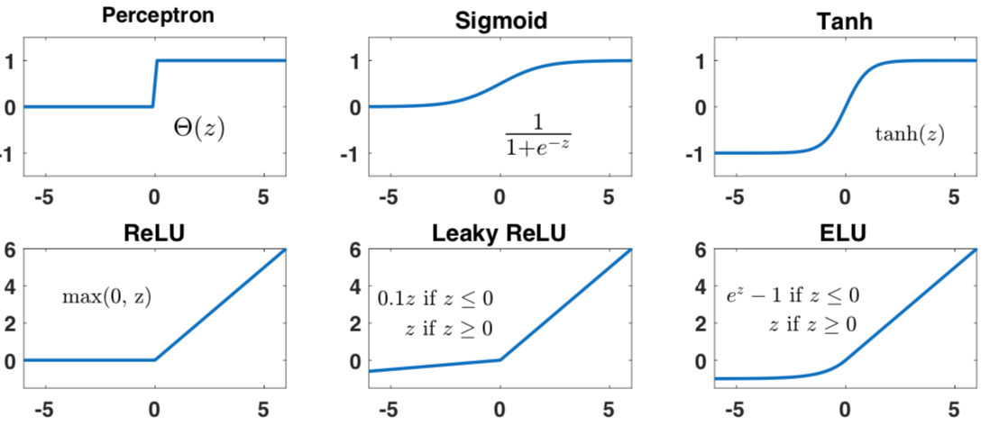

<https://d2l.ai/> Deep Learning book

<https://github.com/reshamas/fastai_deeplearn_part1> .  FastAI

<https://dlcourse.ai/> . russian class starts Feb 18

<https://www.coursera.org/learn/supervised-learning/home/welcome>  Обучение на размеченных данных

<https://stanford.edu/~shervine/teaching/cs-229/cheatsheet-deep-learning>

<https://stanford.edu/~shervine/teaching/cs-230/cheatsheet-recurrent-neural-networks>

<https://stanford.edu/~shervine/teaching/cs-230/cheatsheet-deep-learning-tips-and-tricks>

<https://stanford.edu/~shervine/teaching/cs-230/cheatsheet-convolutional-neural-networks>

<https://github.com/Yorko/mlcourse.ai>

 Dropout
 
 Batchnorm  
 
 Randomly horizontal flipping the train images
 
 Transfer Learning 

<https://deeplearningcourses.com/>

<https://www.analyticsvidhya.com/blog/category/deep-learning/>

<https://www.analyticsvidhya.com/blog/2018/12/best-data-science-machine-learning-projects-github/>

<https://deepnotes.io/>

<https://jaedukseo.me/>

<https://github.com/vivekstorm/AI-Resource>

<https://github.com/kmario23/deep-learning-drizzle>

<https://habr.com/ru/post/439688/>  Обзор AI & ML решений в 2018 году и прогнозы на 2019 год: Часть 1 
<https://habr.com/ru/post/439724/> . Обзор AI & ML решений в 2018 году и прогнозы на 2019 год: Часть 2 

<https://github.com/Mybridge/amazing-machine-learning-opensource-2019>

<https://habr.com/ru/post/414165/> . Курс о Deep Learning на пальцах

<https://www.youtube.com/channel/UCQj_dwbIydi588xrfjWSL5g/videos> . ru

<https://www.fast.ai/2019/01/24/course-v3/>

<https://news.ycombinator.com/item?id=18852974> .  Graph NN

<https://thegradient.pub/>

<https://www.reddit.com/r/MachineLearning/comments/anrams/d_sharing_my_personal_resource_list_for_deep/>
<https://gengo.ai/articles/best-20-ai-and-machine-learning-blogs-to-follow-religiously/>

<https://gengo.ai/articles/20-best-youtube-channels-for-ai-and-machine-learning/>

## Code

<https://habr.com/ru/post/440190/> . python

<https://github.com/kaszperro/slick-dnn> Deep NN in pure python

<https://github.com/Merwanedr/Vusion> image analysis using AI

<https://github.com/Merwanedr/Popbot> . image transformation

<https://github.com/Mybridge/amazing-machine-learning-opensource-2019>

<https://github.com/keras-team/keras/tree/master/examples> Keras

<https://github.com/Yorko/mlcourse.ai/tree/master/jupyter_russian>

<https://heartbeat.fritz.ai/classification-with-tensorflow-and-dense-neural-networks-8299327a818a>

<https://github.com/vietnguyen91/Deeplab-pytorch>

<https://nextjournal.com/mpd/image-classification-with-keras>

 
## Classes

<https://www.bitdegree.org/user/course/python-image-recognition/player/1021>  course

<https://www.youtube.com/playlist?list=PLqYmG7hTraZDNJre23vqCGIVpfZ_K2RZs> . course

<https://www.reddit.com/r/MachineLearning/comments/a0xfc2/p_illustrated_deep_learning_cheatsheets_covering/>

<https://www.microsoft.com/en-us/research/publication/pattern-recognition-machine-learning/>

<https://medium.com/atlas-ml/state-of-deep-learning-h2-2018-review-cc3e490f1679> State of ML in 2018

## NN arhitecture

<https://www.youtube.com/watch?v=XY5AczPW7V4> .  Russ

<https://habr.com/company/nixsolutions/blog/430524/> . Архитектуры нейросетей

https://habr.com/post/433804/ . MNN

<https://habr.com/company/oleg-bunin/blog/340184/> .   NN Zoo

<https://arxiv.org/abs/1806.08342> .  Quantizing deep convolutional networks for efficient inference: A whitepaper

<https://arxiv.org/abs/1810.08533>   convolution and correlation using Fourier transform

<http://web.stanford.edu/class/cs294a/sparseAutoencoder.pdf>

<https://www.nvidia.ru/object/machine-learning-ai-nvidia-blog-ru.html>

<https://habr.com/company/intel/blog/429818/> Intel Vision Accelerator with Deep Learning

<https://habr.com/post/417209/> . Обзор курсов и статей на русском языке

<https://habr.com/post/414165/>  Курс о Deep Learning на пальцах

<https://habr.com/company/ods/blog/344044/> . Материалы открытого курса OpenDataScience 

<https://mlcourse.ai/>

<https://onnx.ai/>  common NN format

<http://rapids.ai/>

<https://www.analyticsvidhya.com/blog/category/deep-learning/>

<https://twitter.com/petewarden>

<https://twitter.com/lc0d3r>

<https://www.youtube.com/watch?v=o64FV-ez6Gw> Joel Grus - Livecoding Madness - Let's Build a Deep Learning Library

<https://bair.berkeley.edu/blog/2018/08/06/recurrent/>

<https://www.youtube.com/watch?v=Agv-SioIZac&list=PL-_cKNuVAYAUWTBKPpWbTGmo5zadoaeCk> russian

<https://jalammar.github.io/feedforward-neural-networks-visual-interactive/>

<https://deepnotes.io/>

<http://iamtrask.github.io/>

<https://stanford.edu/~shervine/teaching/cs-229/cheatsheet-deep-learning>

<https://stats.stackexchange.com/questions/154879/a-list-of-cost-functions-used-in-neural-networks-alongside-applications>

## Deep Learning

<https://www.youtube.com/watch?v=40mnpYTPpJg> .  Russian

<https://arxiv.org/abs/1810.01109> Deep Learning on Android

<http://www.deeplearningbook.org/> . BOOK

<https://www.youtube.com/playlist?list=PLldrX-tcWesPRtPAJuQkBo3drEMyAlV2c> .  complimentary youtube channel

<http://neuralnetworksanddeeplearning.com/index.html> . book

<https://github.com/rasbt/deep-learning-book> book

<https://blog.floydhub.com/guide-to-hyperparameters-search-for-deep-learning-models/>

<https://medium.com/octavian-ai/which-optimizer-and-learning-rate-should-i-use-for-deep-learning-5acb418f9b2>

<http://course.fast.ai/>

<https://www.zerotodeeplearning.com/>

<https://github.com/ysh329/deep-learning-model-convertor>

<https://www.youtube.com/watch?v=9X_4i7zdSY8&t=2s>

<https://datascience.stackexchange.com/questions/12851/how-do-you-visualize-neural-network-architectures>

<https://modelzoo.co/>

<http://cs231n.stanford.edu/slides/2018/>

## DL on Edge
<https://towardsdatascience.com/deep-learning-on-the-edge-9181693f466c>

<https://towardsdatascience.com/why-machine-learning-on-the-edge-92fac32105e6>

<https://medium.com/@bryancostanich/the-future-is-tiny-44dea02e4517>

## ARM
<https://www.dlology.com/blog/how-to-run-deep-learning-model-on-microcontroller-with-cmsis-nn/>
<https://www.youtube.com/watch?v=jlYDrmYJxh4>
<https://developer.arm.com/products/processors/machine-learning/>
<https://community.arm.com/processors/b/blog/posts/new-neural-network-kernels-boost-efficiency-in-microcontrollers-by-5x>
<https://github.com/ARM-software/CMSIS_5>
<https://www.slideshare.net/linaroorg/hkg18312-cmsisnn>

Given probability p, the corresponding odds are calculated as p / (1 – p). 
The logit function is simply the logarithm of the odds: logit(x) = log(x / (1 – x)).
The value of the logit function heads towards infinity as p approaches 1 and towards negative infinity as it approaches 0.

The logit function is useful in analytics because it maps probabilities (which are values in the range [0, 1]) to the full range of real numbers. In particular, if you are working with “yes-no” (binary) inputs it can be useful to transform them into real-valued quantities prior to modeling. This is essentially what happens in logistic regression.

The inverse of the logit function is the sigmoid function. That is, if you have a probability p, sigmoid(logit(p)) = p. The sigmoid function maps arbitrary real values back to the range [0, 1]. The larger the value, the closer to 1 you’ll get.

The formula for the sigmoid function is σ(x) = 1/(1 + exp(-x)).

## Vanishing gradient problem
<https://en.wikipedia.org/wiki/Vanishing_gradient_problem>

<https://www.quora.com/What-is-the-vanishing-gradient-problem>

Vanishing gradient problem depends on the choice of the activation function. Many common activation functions (e.g sigmoid or tanh) 'squash' their input into a very small output range in a very non-linear fashion. For example, sigmoid maps the real number line onto a "small" range of [0, 1]. As a result, there are large regions of the input space which are mapped to an extremely small range. In these regions of the input space, even a large change in the input will produce a small change in the output - hence the gradient is small.

We can avoid this problem by using activation functions which don't have this property of 'squashing' the input space into a small region. A popular choice is Rectified Linear Unit which maps 𝑥 to 𝑚𝑎𝑥(0,𝑥).

Rectified Linear activation function does not have this problem. The gradient is 0 for negative (and zero) inputs and 1 for positive inputs

<https://pythonprogramming.net/introduction-deep-learning-python-tensorflow-keras/>

<https://www.youtube.com/watch?v=T0r-uCXvDzQ>

<https://www.youtube.com/watch?v=aircAruvnKk>

https://docs.devicehive.com/docs

https://ai.googleblog.com/2017/05/using-machine-learning-to-explore.html

Nilolenko DeepLearning book
<https://www.amazon.com/Deep-Learning-Applications-Using-Python/dp/1484235150/>   

## RNN LSTM

https://towardsdatascience.com/the-fall-of-rnn-lstm-2d1594c74ce0  The fall of RNN / LSTM use Attention Networks

<https://towardsdatascience.com/neural-network-embeddings-explained-4d028e6f0526>

The 28 × 28 image was considered a one-dimensional vector of size 282 = 796. But this transformation throws away lots of the spatial information contained in the image.
The CNN take advantage of this additional structure (locality and translational invariance) 

